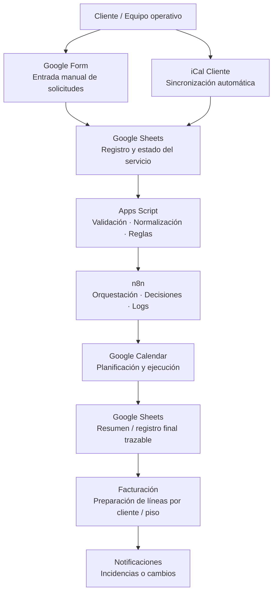

# Kominplis — Operational System Automation

## Contexto
Empresa de servicios de limpieza con alta recurrencia, múltiples clientes y coordinación diaria de operaciones.

## Problema
- Servicios gestionados manualmente
- Información repartida entre calendarios, hojas y mensajes
- Falta de control sobre lo ejecutado vs lo facturado
- Alto riesgo de errores y dependencia humana

## Impacto de negocio
- Reducción de errores operativos diarios
- Visibilidad completa de servicios ejecutados vs facturados
- Menos dependencia de personas clave
- Base sólida para escalar sin aumentar estructura

## Solución
Diseño e implantación de un sistema operativo automático que:
1. Centraliza los servicios solicitados
2. Sincroniza calendarios operativos
3. Registra cada servicio ejecutado
4. Prepara la información para facturación
5. Mantiene trazabilidad completa del proceso

## Diseño del sistema — Entradas
El sistema está diseñado para aceptar **múltiples fuentes de entrada**, garantizando
automatización completa sin perder control ni trazabilidad.
### Entrada manual (Google Forms)
- Utilizada por el equipo operativo cuando el cliente no dispone de integración
- Permite registrar solicitudes puntuales o excepciones
- Validación inmediata de datos en origen
### Entrada automática (iCal del cliente)
- Integración directa con calendarios iCal proporcionados por los clientes
- Sincronización continua de servicios programados
- Reflejo automático de altas, modificaciones y cancelaciones

Desde el punto de vista operativo, el iCal actúa como una **fuente de verdad externa**,
asegurando que cualquier cambio realizado por el cliente se propaga al sistema interno
sin intervención manual.

Desde el punto de vista técnico:
- Consumo del iCal como feed de eventos
- Normalización y validación antes de persistir los datos
- Prevención de duplicidades entre entradas manuales y automáticas

## Diagrama de arquitectura

## Stack técnico
- Google Forms
- Google Sheets
- Google Calendar
- Google Apps Script
- n8n
- Automatizaciones de validación y sincronización

## Resultado
- Control total de la operativa diaria
- Eliminación de errores de coordinación
- Base sólida para facturación automática
- Sistema escalable sin añadir personal

## Decisiones clave
- Separar entrada de datos, ejecución y facturación
- Priorizar fiabilidad y trazabilidad sobre complejidad

## Arquitectura y decisiones técnicas
- Sistema basado en eventos (formularios y calendario)
- Separación clara entre entrada de datos, ejecución y facturación
- Validaciones automáticas para evitar inconsistencias
- Prioridad absoluta a fiabilidad frente a complejidad

