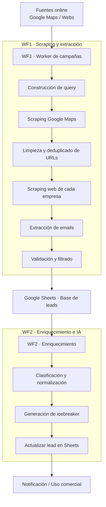

# Lead Scraping & Enrichment Automation
## Antes / Después
**Antes**
- Búsqueda manual de leads en Google y directorios
- Información incompleta o desactualizada
- Mucho tiempo invertido para pocos resultados
- Proceso imposible de escalar

**Después**
- Detección automática de oportunidades
- Enriquecimiento y normalización de datos
- Base de leads consistente y reutilizable
- Sistema escalable y reproducible

## Contexto
Consultoría B2B que necesita generar leads de forma recurrente sin trabajo manual.

## Problema
- Búsqueda manual en Google y directorios
- Datos incompletos o inconsistentes
- Cero trazabilidad del proceso

## Solución
Sistema automático que:
1. Detecta nuevas oportunidades (fuentes online)
2. Extrae datos clave (nombre, web, email, sector)
3. Normaliza y valida la información
4. Guarda los leads en una base central
5. Notifica cuando hay nuevos leads listos

## Stack técnico
- n8n
- Google Sheets
- HTTP Requests / APIs
- LLM para clasificación y normalización (cuando aplica)

## Resultado
- Generación continua de leads
- Eliminación del trabajo manual
- Proceso reproducible y escalable

## Decisiones clave
- Separar scraping, validación y almacenamiento para evitar errores en cascada
- Usar IA solo para clasificación, no para scraping

## Diagrama de arquitectura

El sistema se divide en workers independientes para garantizar escalabilidad, control y trazabilidad del proceso.

